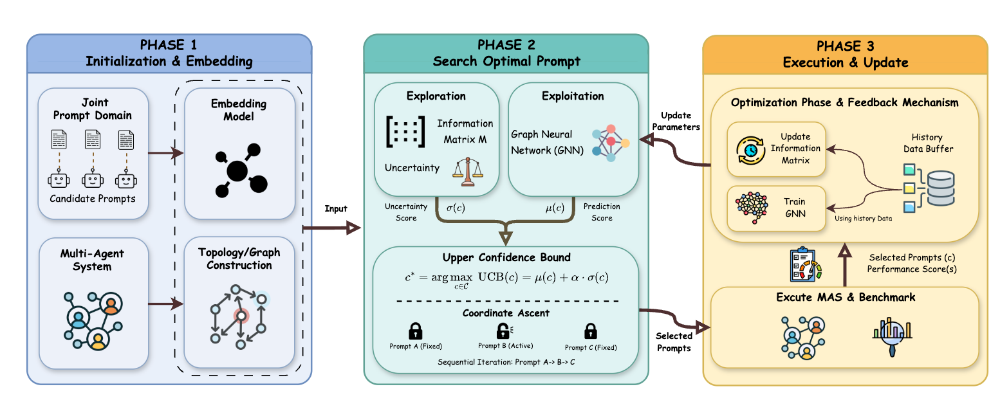

# MASPOB: Bandit-Based Prompt Optimization for Multi-Agent Systems with Graph Neural Networks

<p align="center">
  <a href="https://arxiv.org/abs/2603.02630"></a>
  
  <a href="https://github.com/HZ1008/MASPOB"></a>
  
</p>

> **ICML 2026 Spotlight** | [Paper](https://arxiv.org/abs/2603.02630)

Official code for the paper:

**MASPOB: Bandit-Based Prompt Optimization for Multi-Agent Systems with Graph Neural Networks**<br>
Zhi Hong\*, Qian Zhang\*, Jiahang Sun, Zhiwei Shang, Mingze Kong, Xiangyi Wang, Yao Shu, Zhongxiang Dai

---

## Overview

Large Language Models (LLMs) are increasingly deployed as Multi-Agent Systems (MAS) where multiple specialized agents collaborate through a fixed workflow. Since the workflow topology is often locked due to expert vetting, safety validation, or compliance constraints, **prompt optimization becomes the primary lever for improving system performance**.

However, prompt optimization for MAS poses three fundamental challenges:

1. **Expensive evaluations** — end-to-end MAS execution requires multiple LLM calls, severely limiting the evaluation budget.
2. **Topology-induced coupling** — changing an upstream prompt shifts the input distribution of all downstream agents, making independent optimization unreliable.
3. **Combinatorial explosion** — the joint prompt space grows exponentially with the number of agents.

**MASPOB** addresses all three challenges by combining:

- 🎯 **UCB Bandit Exploration** — frames prompt selection as a contextual bandit problem; an Upper Confidence Bound (UCB) criterion balances exploration and exploitation within a strict evaluation budget.
- 🕸️ **GNN Topology-Aware Surrogate** — a Graph Attention Network (GAT) encodes the MAS workflow DAG, capturing how prompt changes propagate along inter-agent edges.
- 🔍 **Coordinate Ascent Search** — decomposes the combinatorial search into a sequence of tractable univariate updates, reducing complexity from exponential to linear.

<p align="center">
  
</p>

*Figure: The MASPOB framework. (1) **Initialization** — constructs agent topology and generates prompt embeddings. (2) **Search** — selects optimal prompts via Coordinate Ascent, balancing exploitation (GNN prediction) and exploration (Linear UCB uncertainty). (3) **Update** — refines the GNN model and information matrix using execution feedback.*

---

## Installation

```bash
git clone https://github.com/HZ1008/MASPOB.git
cd MASPOB
pip install -r requirements.txt
```

**Requirements:** Python 3.10+, PyTorch 2.0+, and an OpenAI-compatible API key.

---

## Configuration

### API Key

Open `config/config2.yaml` and fill in your API key, **or** set the corresponding environment variable (the env var takes priority over the yaml value):

| Provider | Environment Variable |
|---|---|
| OpenRouter | `OPENROUTER_API_KEY` |
| OpenAI | `OPENAI_API_KEY` |
| Anthropic | `ANTHROPIC_API_KEY` |
| DeepSeek | `DEEPSEEK_API_KEY` |
| Other | `LLM_API_KEY` |

```yaml
# config/config2.yaml
models:
  "gpt-4o-mini":
    base_url: "https://openrouter.ai/api/v1"
    api_key: "YOUR_OPENROUTER_API_KEY_HERE"   # or set OPENROUTER_API_KEY env var
    model: "openai/gpt-4o-mini"
    temperature: 0.5
  "gpt-4o-mini-exec":
    base_url: "https://openrouter.ai/api/v1"
    api_key: "YOUR_OPENROUTER_API_KEY_HERE"
    model: "openai/gpt-4o-mini"
    temperature: 0
```

---

## Quick Start

```bash
python run.py --dataset HotpotQA --ucb_type linear
```

### Key Arguments

| Argument | Default | Description |
|---|---|---|
| `--dataset` | `HotpotQA` | Dataset to optimize on (`DROP`, `HotpotQA`, `GSM8K`, `MATH`, `HumanEval`, `MBPP`) |
| `--ucb_type` | `linear` | UCB variant: `linear` (prompt embeddings), `neural` (GNN gradients), `greedy` (no exploration) |
| `--max_rounds` | `45` | Number of optimization rounds after pretraining |
| `--pretrain_rounds` | `5` | Number of random-exploration pretraining rounds |
| `--num_prompts` | `20` | Number of prompt candidates generated per operator |
| `--sample` | auto | Validation samples per round (dataset-specific default if unset) |
| `--search_strategy` | `coordinate` | `coordinate` (coordinate ascent) or `exhaustive` |
| `--ucb_alpha` | `0.2` | Exploration coefficient α for UCB |
| `--opt_model_name` | `gpt-4o-mini` | LLM used for prompt generation |
| `--exec_model_name` | `gpt-4o-mini-exec` | LLM used for workflow execution |
| `--run_test` | `true` | Run test-set evaluation after optimization |

---

## Supported Datasets

| Dataset | Domain | Metric |
|---|---|---|
| HotpotQA | Multi-hop QA | F1 |
| DROP | Reading Comprehension + Numerical | F1 |
| GSM8K | Mathematical Reasoning | Accuracy |
| MATH | Mathematical Reasoning | Accuracy |
| HumanEval | Code Generation | pass@1 |
| MBPP | Code Generation | pass@1 |

---

## Project Structure

```
MASPOB/
├── run.py                    # Main entry point
├── config/
│   ├── config2.yaml          # LLM model configurations and API keys
│   ├── experiment_config.py  # Dataset-specific experiment settings
│   ├── workflow_topology.py  # MAS workflow DAG definitions
│   └── prompt_config.py      # Prompt domain settings
├── scripts/
│   ├── gnn_model.py          # WorkflowGAT model and UCB utilities
│   ├── embeddings.py         # Sentence embedding utilities
│   ├── operators.py          # MAS operator implementations
│   ├── workflow.py           # Workflow execution engine
│   ├── async_llm.py          # Async LLM client with retry logic
│   └── prompts/              # Prompt generation and optimization
├── benchmarks/               # Benchmark evaluation classes
├── workspace/                # Per-dataset workflow definitions
│   ├── DROP/
│   ├── HotpotQA/
│   ├── GSM8K/
│   ├── MATH/
│   ├── HumanEval/
│   └── MBPP/
├── prompt_domain/            # Seed prompt templates
├── data/                     # Datasets (auto-downloaded)
└── result_CSV/               # Experiment results (auto-generated)
```

---

## Citation

If you find this work useful, please cite:

```bibtex
@article{hong2026maspob,
  title={MASPOB: Bandit-Based Prompt Optimization for Multi-Agent Systems with Graph Neural Networks},
  author={Hong, Zhi and Zhang, Qian and Sun, Jiahang and Shang, Zhiwei and Kong, Mingze and Wang, Xiangyi and Shu, Yao and Dai, Zhongxiang},
  journal={arXiv preprint arXiv:2603.02630},
  year={2026}
}
```

---

## Acknowledgments

This codebase builds upon [AFlow](https://github.com/FoundationAgents/AFlow). We thank the AFlow authors for releasing their code, which provided the foundation for our workflow execution engine, operator abstractions, and benchmark evaluation framework.

---

## License

This project is released for research purposes. Please refer to the paper for details.

